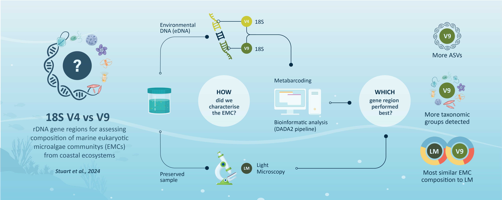
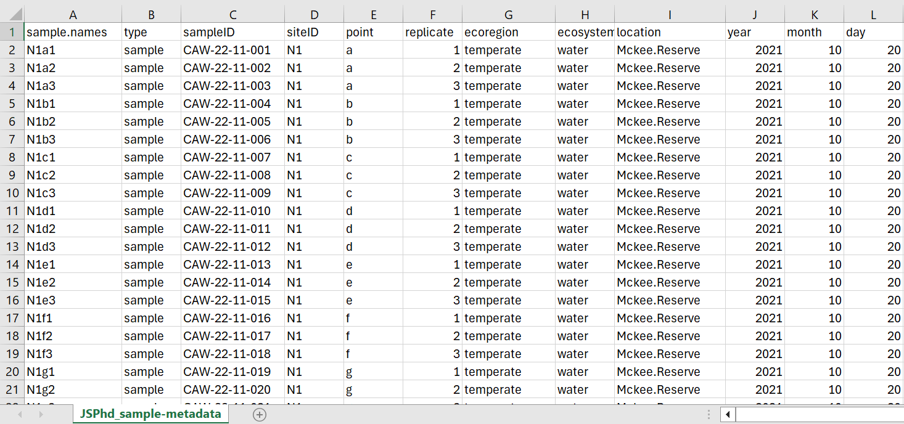

# Region Comparison metabarcoding pipeline
### Contents
[About](#about)   |   [Data and Files](#data-and-files)   |   [Overhang adaptors](#overhang-adaptors)

***
### About  
This pipeline was used to process and analyse metabarcoding data for the publication: 

  Stuart, J., et al., <i> A comparison of two gene regions for assessing community composition of eukaryotic marine microalgae from coastal ecosystems</i>. 
Scientific Reports, 2024. <b>14</b>(1): p. 6442. doi: <a href="http://dx.doi.org/10.1038/s41598-024-56993-4">10.1038/s41598-024-56993-4</a> 

  

***
### Data and files
There were three main types of input files for the analysis in this pipeline:
  -  Metabarcoding files (.fastq)
  -  Taxonomy files (.RDS)
  -  Metadata (.csv)
  
#### Metadata layout

Sample/sequence metadata files were in the format depicted below

  

***

### Overhang adaptors

Primer pairs used for this paper were each modified for Illumina sequencing with the addition of overhang adaptors. The Illumina overhang adapter sequences to be added to locus‐specific sequences are as follows.
   
   
  <b>Forward overhang:</b> 
5’ TCGTCGGCAGCGTCAGATGTGTATAAGAGACAG ‐ [locus specific sequence]  
<b>Reverse overhang:</b> 
5’ GTCTCGTGGGCTCGGAGATGTGTATAAGAGACAG ‐ [locus specific sequence]  
   
Full documentation can be found in the 
  <a href="http://support.illumina.com/documents/documentation/chemistry_documentation/16s/16s-metagenomic-library-prep-guide-15044223-b.pdf">Illumina metagenomic library prep guide</a> 
  

</body>
